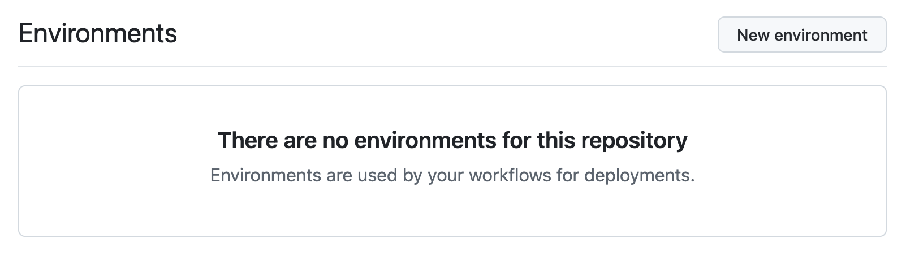
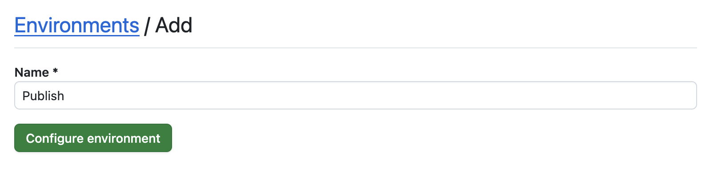
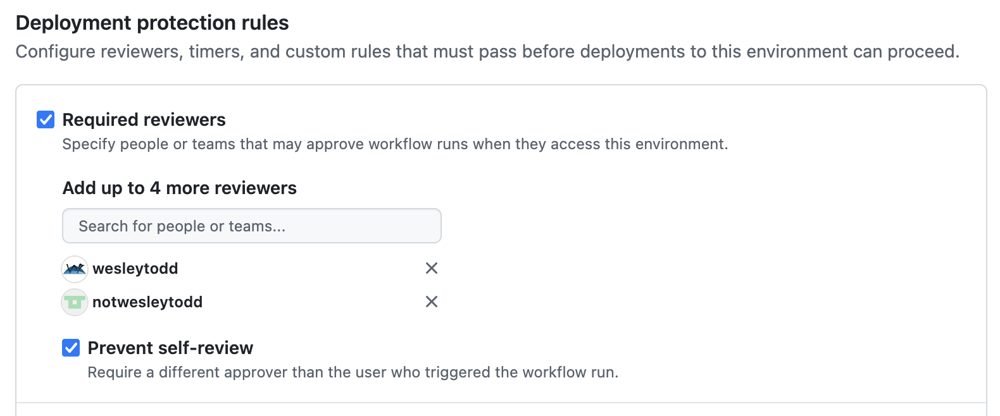
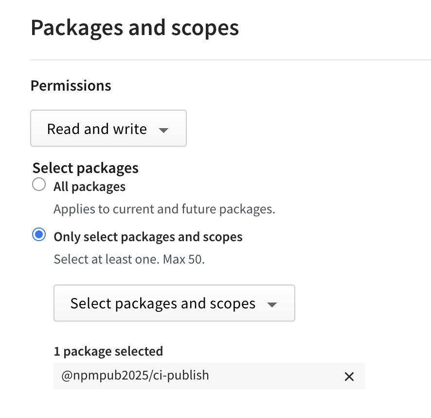
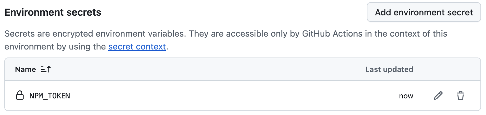
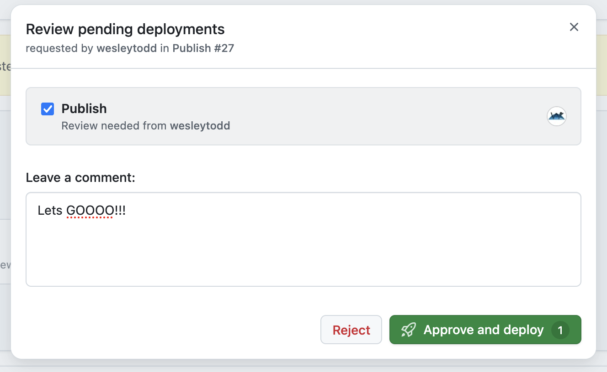
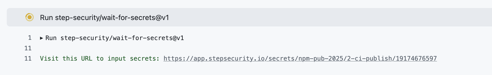
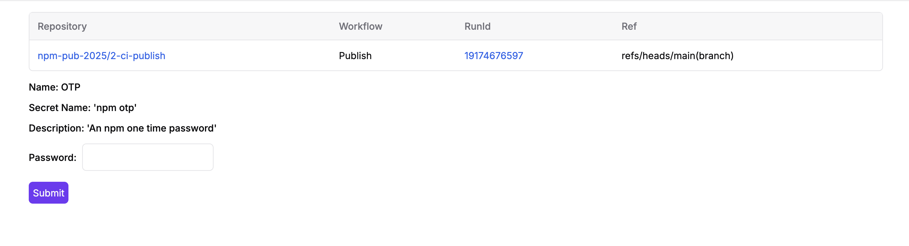

# Publishing from CI with 2FA

Publishing from CI takes some added configuration and added security measures to prevent malicious publishes like we
have seen over the past year from miss-configured CI and phished accounts. This setup is only recommended for advanced
users and projects which are very active and have multiple maintainers.

This example shows a setup with both Environments and npm registry 2FA. Both of these are required to protect from
different types of attacks.

- GitHub Environments: By having the publish token in the environment (not a repo level secret) and the publish action
  *only* doing publish (no install) it protects your token from leaking via simple CI configuration mistakes (ex. the
  Nx compromise).
- npm registry 2FA: This prevents automated attacks with a compromised GitHub token from triggering a release via the CI
  workflow.

Ultimately in security, nothing is ever "safe" or "trusted". The goal of this workflow is to balance security with user
experience, but admittedly it is still rather difficult to setup and use (please github hear our plea and give us better
options).

If you have not yet read the (Publishing Locally)[https://github.com/npm-pub-2025/local-publish] guide, you should
**stop here** and go setup all the things it tells you to do under "npm Account Settings" as those are *always*
necessary no matter how you intend to publish your packages.

## Setting up CI Publish

**1. Create your Environment**

Under the repositories Settings in the left sidebar is an Environments section. Once there, click the "New Environment"
button in the top left.



Give it a name.



**2. Setup required reviewers**

The first section is where you can setup required reviewers. This will mean that your publish workflow will require a
teammate's approval (or you can allow self approval, but that means an attacker with your GH token can self approve)
before running.





**3. Setup Granular Access Token**

Now on the npm website, under Access tokens in the menu, create a new Granular Access Token. Ensure you leave "bypass
second-factor authentication (2FA)" *unchecked*. Set your expiration to whatever you consider a reasonable time-frame
to rotate your token (remember, shorter token expiry does not enhance security, so set it as far out as they allow).
Finally, give the token read/write only on your single package name.




**4. Save your GAT (granular access token) in your Environment**

Back in the Github UI, add your newly created GAT to your environment as a secret. The name here is what we reference in
the Action workflow.



**5. Configure your workflow**

Now that you have setup the prerequisites, you can setup your Actions workflow. You can see the
[full example here](blob/main/.github/workflows/publish.yml), but below we will call out the key parts to pay
attention for.

**Permissions:**

```yaml
permissions:
  contents: write
  id-token: write
```

These permissions give the action the ability to push the version commit back to the repo (`contents`) and allows the
Step Security action to provide the token in a secure way (`id-token`).

**Environment:**

```yaml
environment: publish
```

This is what hooks this action up to your Environment created above.

**2FA:**

```yaml
- uses: step-security/wait-for-secrets@v1
  id: otp
  with:
    slack-webhook-url: ${{ secrets.SLACK_WEBHOOK_URL }}
    secrets: |
      OTP:
        name: 'npm otp'
        description: 'An npm one time password'
```

The `wait-for-secrets` action is provided by a third party, and allows for input of the OTP for our npm 2FA. There are
multiple other ways to do this ([for example](https://github.com/mmarchini-oss/npm-otp-publish)), but currently all require a third-party.

```yaml
- name: npm publish
  run: |
    npm publish --access=public --tag="${{ inputs.tag }}" --otp="${{ steps.otp.outputs.OTP }}"
```

Lastly, this takes the OTP and publishes the package to npm.

## How To Publish

This workflow uses a manual `workflow_dispatch` trigger, but there are many reliable ways you could trigger the release.
For this one, you will start by going to the workflow in the Github Action UI and finding your Publish workflow. On the
top right you will see a Run Workflow button you can use to kick off the run.


Your co-collaborators with required review will receive a notification like the email below, and will need to go approve
your release.




This will start the workflow run, but when it reaches the `wait-for-secrets` step it will pause and print out a URL you
need to visit to provide your OTP. This is then passed to the following `npm publish` step and will finish with creating
the release.





